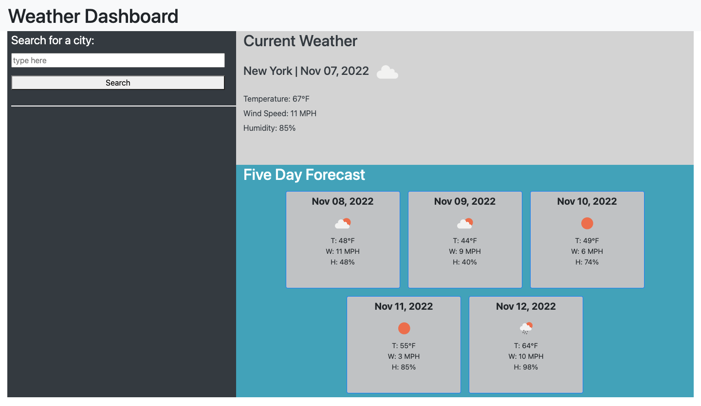

# Weather Dashboard (Web Application)

## Description

Users can access this web application to find weather information for a city (source of the data: OpenWeather API). On this weather dashboard, users can enter and submit a city name, and searched city names are stored and displayed as part of the search history. Current weather information and forecasted data (including temperature, wind speed, and humidity) for a city are displayed on this dashboard.

The codebase for this weather dashboard can be accessed via the links below. The use of the OpenWeather API, jQuery, and local storage can be observed from there. 

## Links and Usage 

To access the deployed application, please visit: https://jamscc.github.io/web-app-weather-dashboard/

Users can access the codebase in Chrome by navigating to Chrome DevTools. The codebase can also be accessed via the following link:

https://github.com/jamscc/web-app-weather-dashboard

## Screenshot

The following is the screenshot for the web application:

